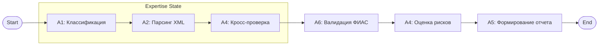

# 🛡️ Moslicenzia Expertise Subsystem (AI Expert)

[](https://www.python.org/)
[](https://langchain-ai.github.io/langgraph/)
[](https://streamlit.io/)
[](https://modelcontextprotocol.io/)
[](https://opensource.org/licenses/MIT)

**Moslicenzia AI Expert** — это профессиональная мультиагентная система, предназначенная для интеллектуальной автоматизации процесса предварительной экспертизы документов при лицензировании розничной продажи алкогольной продукции. Система объединяет современные методы анализа структурированных данных (XML), протокол MCP и гибкую оркестрацию на базе LangGraph для обеспечения исключительной точности и скорости проверки.

---

## 🌟 Основные бизнес-функции

- **Снижение операционных рисков**: Автоматическое выявление критических ошибок (несоответствие ИНН, КПП, задолженности).
- **Экономия времени**: Время анализа полного пакета документов сокращается с десятков минут до нескольких секунд.
- **Прозрачность процесса**: Формирование детализированных отчетов по каждой проверке с четким обоснованием решения.
- **Цифровой суверенитет**: Использование собственных механизмов скрейпинга ФИАС без зависимости от сторонних коммерческих API (DaData и др.).

---

## 🏗️ Глубокая Техническая Архитектура

Система реализована как **Directed Acyclic Graph (DAG)** на базе LangGraph, что позволяет гибко управлять состоянием экспертизы и обеспечивать отказоустойчивость.

### 🧩 Мультиагентная система

| Агент | Роль | Технологии | Описание |
| :--- | :--- | :--- | :--- |
| **A1: Reception** | Регистратор | Python, XPath | Классифицирует файлы по контенту и метаданным. Поддерживает типы: ЕГРЮЛ, РОСРЕЕСТР, ФНС, РНиП. |
| **A2: Parser** | Структурный парсер | lxml, XPath | Глубоко извлекает атрибуты из XML. Обрабатывает сложные вложенные структуры (напр. обособленные подразделения). |
| **A4: Orchestrator** | Аналитический центр | LangGraph | Управляет состоянием `ExpertiseState`. Выполняет межагентские проверки и логический контроль. |
| **A5: Reporter** | Генератор заключений | Jinja2, Markdown | Преобразует результаты анализа в профессиональный экспертный отчет с использованием GitHub-style алертов. |
| **A6: FIAS MCP** | Внешний валидатор | FastMCP, httpx | Отдельный сервис (MCP-сервер), выполняющий прямой поиск в реестре ФИАС/ГАР. |

### 🔄 Рабочий процесс (Workflow)



---

## 🔍 Детальное описание ключевых модулей

### Agent 6: Интеграция с ФИАС (MCP Server)

Модуль реализован с использованием **Model Context Protocol**.

- **Стратегия скрейпинга**: Система последовательно опрашивает официальные эндпоинты `fias.nalog.ru` (`FullTextSearch`, `SearchAddress_Read` и др.), эмулируя поведение реального пользователя.
- **Механизм Fallback**: В случае недоступности портала или специфических запросов, реализована система детерминированных мок-ответов для сохранения работоспособности демо-режима.
- **Безопасность**: Не требует API-ключей и внешних токенов, все запросы идут напрямую к источнику.

### Agent 4: Логический контроль

Центральная логика включает следующие автоматизированные контроли:

- **ИНН Контроль**: Сверка ИНН из Заявления с данными выписки из ЕГРЮЛ.
- **Финансовый аудит**: Проверка суммы оплаты госпошлины по данным системы РНиП (ожидаемая сумма65,000 руб.).
- **Имущественный контроль**: Сверка кадастрового номера объекта из Заявления с данными выписки из РОСРЕЕСТР (ЕГРН).
- **КПП Контроль**: Сравнение КПП объекта из Заявления с актуальным КПП, зарегистрированным в ФИАС для данного адреса.

---

## 🚀 Инструкция по запуску

### 1. Подготовка окружения

```bash
# Клонирование
git clone https://github.com/EdwFa/moslicenze-expert.git
cd moslicenzia-expert

# Создание и активация venv
python -m venv venv
venv\Scripts\activate  # Windows
source venv/bin/activate # Linux/Mac
```

### 2. Установка зависимостей

```bash
pip install -r requirements.txt
```

### 3. Запуск веб-интерфейса

```bash
python -m streamlit run streamlit_app.py
```

### 4. Верификация через консоль

Для тестирования отдельных компонентов доступны скрипты:

- `python verify_agents.py` — Тест классификации и парсинга.
- `python verify_agent6.py` — Тест MCP-сервера ФИАС.
- `python verify_pipeline.py` — Полный цикл экспертизы в консоли.

---

## 📁 Структура Репозитория

```text
moslicenzia-expert/
├── moslicenzia/
│   ├── agents/
│   │   ├── agent1_reception/     # Классификация
│   │   ├── agent2_parser/        # XML-парсинг
│   │   ├── agent4_analytical/    # Оркестрация (LangGraph)
│   │   ├── agent5_report/        # Генерация отчетов
│   │   └── agent6_mcp/           # Скрейпер ФИАС (MCP)
│   ├── data/                     # Тестовые XML-наборы
│   └── schemas/                  # Pydantic модели (ExpertiseState)
├── streamlit_app.py              # Основной UI
├── requirements.txt              # Зависимости
└── README.md                     # Данная документация
```

---

## 🛠️ Технологический стек

> [!NOTE]
> Все компоненты системы локализованы. Комментарии в коде и документация к функциям полностью на русском языке.

- **Backend**: Python 3.11, Pydantic v2
- **Agentic Logic**: LangGraph 0.2+, LangChain
- **Protocol**: MCP (Model Context Protocol) 1.0
- **Parsing**: lxml (lxml.etree), BeautifulSoup4
- **UI & Visualization**: Streamlit, Mermaid.js
- **Templates**: Jinja2

---

## 📈 Планы по развитию

1. **Интеграция OCR**: Добавление Агента 3 для обработки сканированных копий документов (PDF/JPG) с использованием LLM.
2. **Глубокий анализ истории**: Проверка заявителя по историческим данным отозванных лицензий.
3. **Экспорт в PDF**: Реализация формирования юридически значимых PDF-отчетов с цифровой подписью.

---
*Разработано при поддержке Antigravity AI для департамента лицензирования.*
