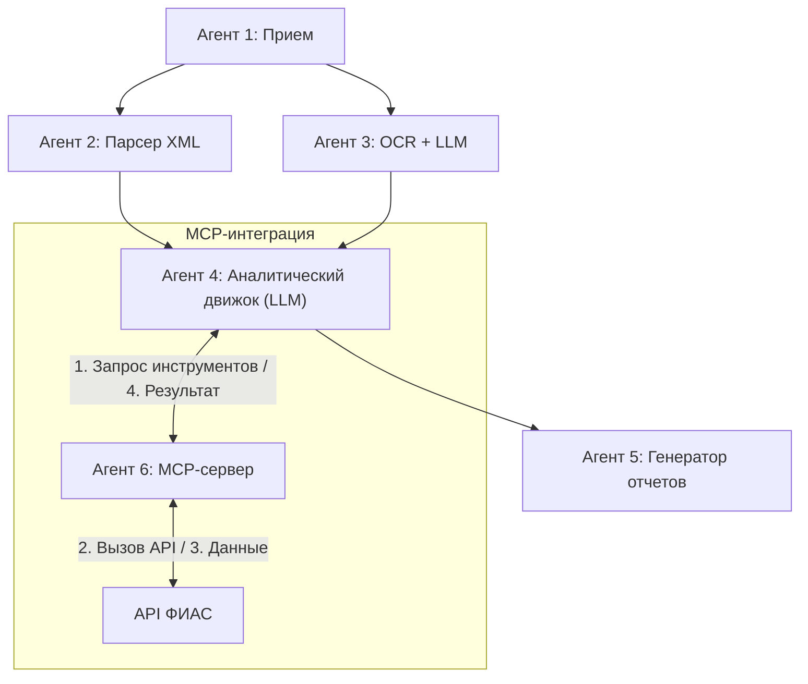

# Implementation Plan - Moslicenzia Hybrid 6-Agent Subsystem

The system follows a hybrid multi-agent architecture with a clear separation of concerns across 6 specialized agents:

## Workflow Diagram

## Technical Stack

- **Backend/Orchestration**: Python, LangGraph.
- **UI**: Streamlit.
- **Protocol**: MCP (Model Context Protocol).
- **External API**: Dadata (FIAS/GAR).

## Proposed Agent Architecture

### 1. Agent 1: Reception and Classification

### 2. Agent 2: Structured Data Parser

### 3. Agent 3: Unstructured Doc Processor (OCR)

### 4. Agent 4: Analytical Engine & Orchestrator

### 5. Agent 5: Report Generator

### 6. Agent 6: MCP FIAS Integrator
